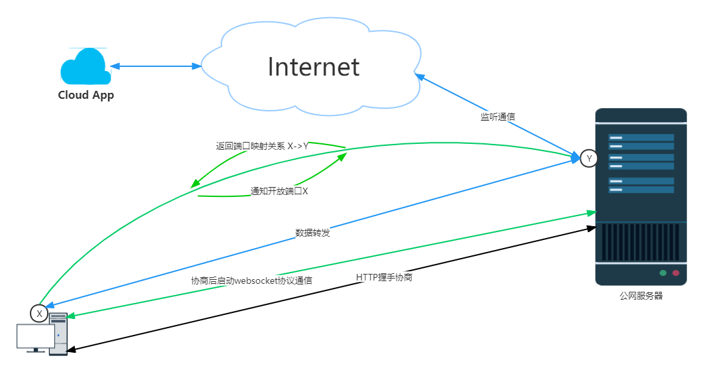
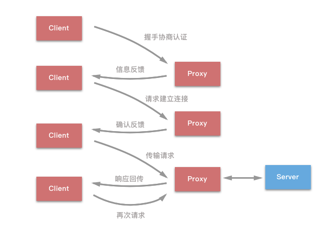
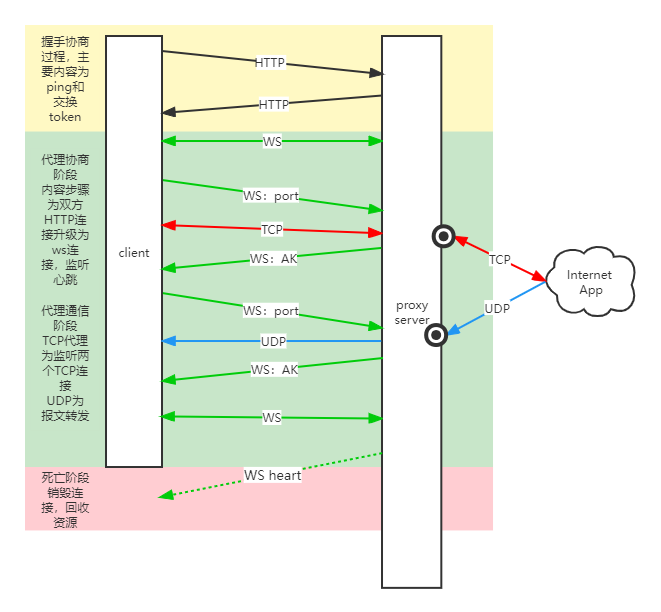

# luckyProxy
go语言实现代理服务器

支持 tcp\udp,以及所有理论上集于tcp\udp的上层协议代理如：ftp代理、http代理，websocket代理

支持socks5代理

tcp\udp代理使用NAT(网络地址转换协议)透明代理实现

socks5使用[socks5协议实现](https://datatracker.ietf.org/doc/html/rfc1928)

## 主要功能：

### NAT代理 

- 代理握手
- 增加代理端口（add port）

  - TCP
  - UDP

- 删除代理端口（remove port）
- 展示代理端口（list ports）
- 帮助指令（help）
- 日志(error、info、性能监控)

### socks5

- socks5代理


包结构：
```
luckyProxy
├─ client                                                   //客户端
│    ├─ client.api
│    ├─ client.go
│    ├─ command
│    │    ├─ cmd_addproxy.go
│    │    ├─ cmd_help.go
│    │    ├─ cmd_list.go
│    │    ├─ cmd_quit.go
│    │    ├─ cmd_removeproxy.go
│    │    ├─ command.go
│    │    └─ path.go
│    ├─ config.go
│    ├─ etc
│    │    └─ client-api.yaml
│    ├─ handler
│    │    ├─ addProxy
│    │    ├─ clienthandler.go
│    │    ├─ dispatch.go
│    │    ├─ removeProxy
│    │    ├─ routes.go
│    │    ├─ userConnect
│    │    └─ userRequest
│    ├─ internal
│    ├─ logic
│    │    └─ clientlogic.go
│    ├─ svc
│    │    └─ servicecontext.go
│    └─ types
│           └─ types.go
├─ cmd                                                   //启动器
│    ├─ client
│    │    ├─ client.exe
│    │    ├─ client.go
│    │    ├─ client.localhost.yaml
│    │    └─ client.yaml
│    └─ server
│           ├─ server.exe
│           ├─ server.go
│           ├─ server.log
│           └─ server.yaml
├─ common                                                   //公共件与代理方式
│    ├─ linereader
│    │    └─ linereader.go
│    ├─ logx
│    │    └─ logger.go
│    ├─ model
│    │    ├─ errors.go
│    │    └─ req
│    ├─ protocal
│    │    └─ burst.go
│    ├─ proxy
│    │    ├─ handleHTTP.go
│    │    ├─ handleTCP.go
│    │    ├─ handleUDP.go
│    │    ├─ serverLunch.go
│    │    └─ userConn.go
│    ├─ result
│    │    └─ httpResult.go
│    ├─ socket5
│    │    ├─ socks5.go
│    │    └─ socks_test.go
│    ├─ types.go
│    └─ wsx
│           ├─ utils.go
│           └─ websocket.go
├─ doc                                                   //说明文档
│    └─ img
│           └─ 拓扑.png
├─ server   //服务端
│    ├─ api
│    │    ├─ ping
│    │    ├─ proxy
│    │    ├─ router.go  
│    │    ├─ user
│    │    └─ ws
│    ├─ cache
│    │    ├─ init.go
│    │    ├─ proxyInfo.go
│    │    └─ server.go
│    ├─ config.go
│    ├─ etc
│    │    └─ server-api.yaml
│    ├─ handler
│    │    ├─ routes.go
│    │    └─ serverhandler.go
│    ├─ logic
│    │    └─ serverlogic.go
│    ├─ server.api
│    ├─ svc
│    │    └─ servicecontext.go
│    └─ types
│           └─ types.go
└─ utils.go                                                   //工具件
```

 

socks5握手示意图



NAT握手示意



## 小问题

为什么使用ws协议

### 为什么不用http

项目中需要client和service相互频繁交互，双方均需要主动请求，使用http无法满足

### 为什么不用TCP

考虑后续发展 ，如今浏览器OS似乎成为趋势，要满足web端运行就要找到一个适合浏览器的协议（WS协议）

### ws优势

- 心跳包检测
- 全双工通信