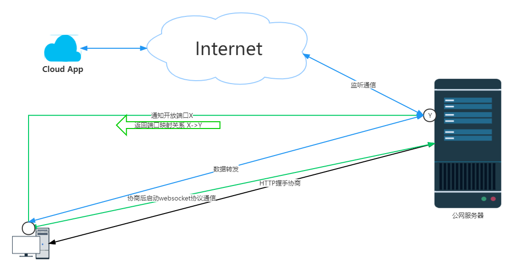

# luckyProxy
go语言实现代理服务器

支持 tcp\udp代理，http代理，websocket代理，socks5代理

tcp\udp代理使用NAT透明代理实现

socks5使用socks5协议实现

 
 
包结构：
```
luckyProxy
├─ client                                                   //客户端
│    ├─ client.api
│    ├─ client.go
│    ├─ command
│    │    ├─ cmd_addproxy.go
│    │    ├─ cmd_help.go
│    │    ├─ cmd_list.go
│    │    ├─ cmd_quit.go
│    │    ├─ cmd_removeproxy.go
│    │    ├─ command.go
│    │    └─ path.go
│    ├─ config.go
│    ├─ etc
│    │    └─ client-api.yaml
│    ├─ handler
│    │    ├─ addProxy
│    │    ├─ clienthandler.go
│    │    ├─ dispatch.go
│    │    ├─ removeProxy
│    │    ├─ routes.go
│    │    ├─ userConnect
│    │    └─ userRequest
│    ├─ internal
│    ├─ logic
│    │    └─ clientlogic.go
│    ├─ svc
│    │    └─ servicecontext.go
│    └─ types
│           └─ types.go
├─ cmd                                                   //启动器
│    ├─ client
│    │    ├─ client.exe
│    │    ├─ client.go
│    │    ├─ client.localhost.yaml
│    │    └─ client.yaml
│    └─ server
│           ├─ server.exe
│           ├─ server.go
│           ├─ server.log
│           └─ server.yaml
├─ common                                                   //公共件与代理方式
│    ├─ linereader
│    │    └─ linereader.go
│    ├─ logx
│    │    └─ logger.go
│    ├─ model
│    │    ├─ errors.go
│    │    └─ req
│    ├─ protocal
│    │    └─ burst.go
│    ├─ proxy
│    │    ├─ handleHTTP.go
│    │    ├─ handleTCP.go
│    │    ├─ handleUDP.go
│    │    ├─ serverLunch.go
│    │    └─ userConn.go
│    ├─ result
│    │    └─ httpResult.go
│    ├─ socket5
│    │    ├─ socks5.go
│    │    └─ socks_test.go
│    ├─ types.go
│    └─ wsx
│           ├─ utils.go
│           └─ websocket.go
├─ doc                                                   //说明文档
│    └─ img
│           └─ 拓扑.png
├─ server   //服务端
│    ├─ api
│    │    ├─ ping
│    │    ├─ proxy
│    │    ├─ router.go  
│    │    ├─ user
│    │    └─ ws
│    ├─ cache
│    │    ├─ init.go
│    │    ├─ proxyInfo.go
│    │    └─ server.go
│    ├─ config.go
│    ├─ etc
│    │    └─ server-api.yaml
│    ├─ handler
│    │    ├─ routes.go
│    │    └─ serverhandler.go
│    ├─ logic
│    │    └─ serverlogic.go
│    ├─ server.api
│    ├─ svc
│    │    └─ servicecontext.go
│    └─ types
│           └─ types.go
└─ utils.go                                                   //工具件
```